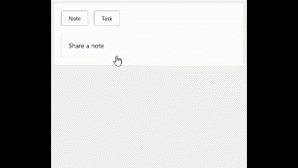
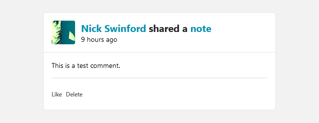
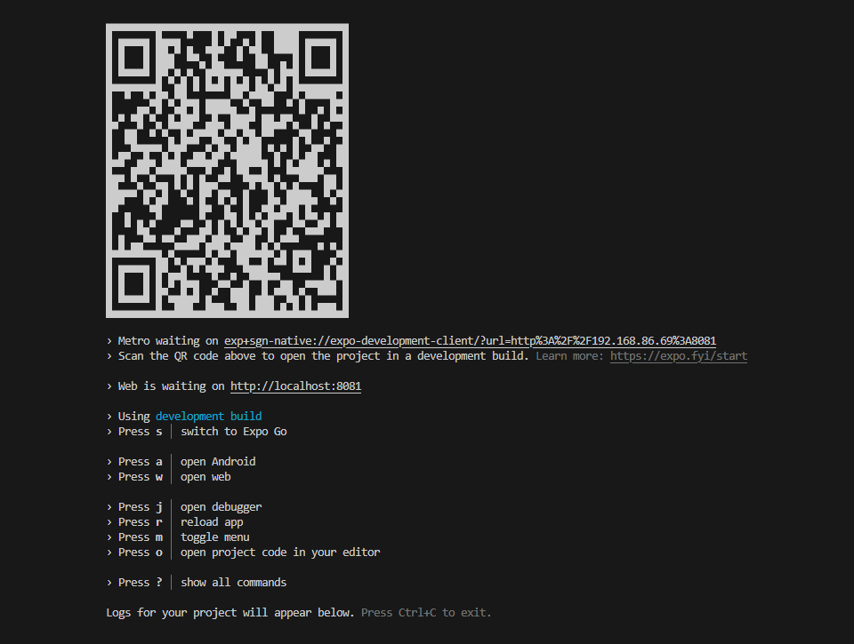

# Welcome to SGN-Native

SGN Native is built with [React Native](https://reactnative.dev/) with [Expo](https://docs.expo.dev/).

* [Gluestack](https://gluestack.io/ui/docs/components/all-components)
    * high quality component library
* [NativeWind](https://www.nativewind.dev/v4/overview/) 
    * utility first styling library
* [TanStack Query](https://tanstack.com/query/latest).
    * state management library

## Usage

The app currently consists of three main parts, Dashboard, Notes and People.

The Dashboard displays a list of activities that have occurred on our API.
This feed is generated based on who the current user is following. Some activities, such as tasks, not currently fully implemented.

Notes can be created using the Composer above the activity feed. This will 
post the Note to your profile where others can interact with it. Posting 
a note will automatically trigger a refresh of the activity feed and you'll
be able to see your note below.

Clicking on "note" in the activity title will take you to the Note's page.
Here you can edit, reply with a comment and delete the note.

## Versions

This app was developed with using the below versioning. It should function
correctly with newer versions.

| Binary | Version |
| --- | --- |
| Node | 18.17.0 |
| npm | 9.6.7 |

## Installation  

Execute the below commands to install the application.

1. `git clone git@github.com:NicholasJohn16/sgn-native.git`

2. `cd sgn-native`

3. `npm install --legacy-peer-deps`

4. If on Windows, `node .\scripts\nativewind-fix.js` This should print
`'NativeWind fix applied successfully!'` to the console when completed.

5. `npx expo start -c`

This should display the command dashboard. With the terminal selected,
press `w` to launch the app in your default browser. NativeWind will 
first compile the css and the the app will build. It will automatically
launch when the build is complete.

> [!CAUTION]
> Due to CORS, **the app must be served at `localhost:8081`**.
> The API host is configured to respond with the correct CORS headers only
> to this address. Authentication and access to the API will not be possible otherwise.

As well, the authentication system is cookie based so cookies, including
third party cookies, will need to be enabled to access the API.

Dark mode has not been fully implemented yet and the app defaults to your browser settings. If your system or browser is set to dark mode, it
may be necessary to switch it to light mode to test the app in its current state.

### Android App

If you'd like to try the Android app, please follow [these instructions](https://docs.expo.dev/get-started/set-up-your-environment/?platform=android&device=physical)
on configuring your development environment. It is not current possible
to build for an iOS device.

#### Expo Go app

If you want to use the Expo Go app to demo the application, you must 
press `j` in the command dashboard to switch to a Expo Go build.

## Directory structure

The structure is highly based on the recommendations for [Bulletproof React]( https://github.com/alan2207/bulletproof-react/blob/master/docs/project-structure.md).

| Folder | Purpose |
| ---  | --- |
| /api | API wrapper |
| /app | routing and page layouts
| /components/core | components that handle functions throughout app |
| /components/helpers | helper functions that adjust strings and dates |
| /components/ui | imported components from Gluestack UI
| /features | app specific code
| /hooks | custom hooks for all app